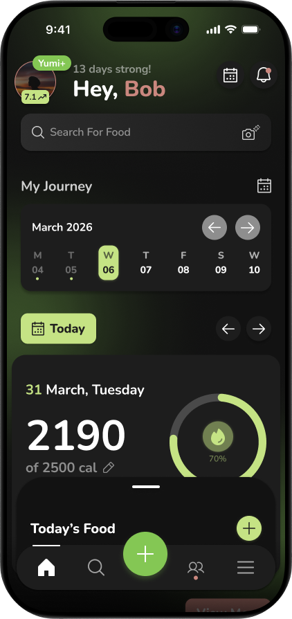
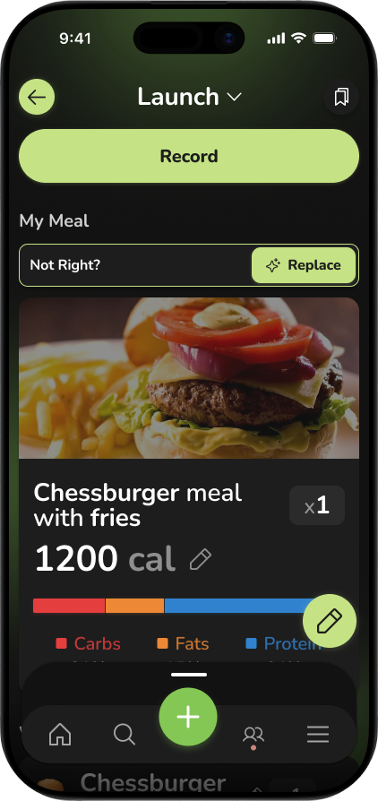
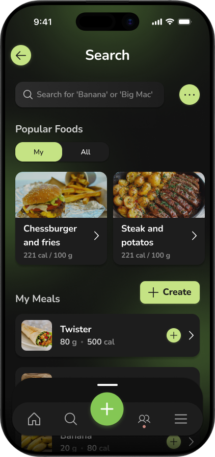

# 🥑 Yumi App
> **Your AI Buddy** | *Revoluční kalorická aplikace s duší.*

---

🔗 **[Figma design](https://www.figma.com/design/bFfSw4wdaiBHYuMloq0Db6/Yumi?node-id=27-317&t=indb5V3jGFt1YbD0-1)**

---

📝 **[Dokumentace](./RP2025-26_Cermak-Yumi.docx)**

---

<p align="center">
  
  
  
</p>

---

**Yumi** není jen další nudná tabulka na kalorie. Je to tvůj digitální parťák (kawaii avokádo), o kterého se staráš tím, že se staráš o sebe. Aplikace využívá nejmodernější AI modely pro okamžitou analýzu jídla z fotek a gamifikuje tvou cestu za zdravějším já.

## ✨ Klíčové funkce

### 🤖 Next-Gen AI Skenování
* **Primární Engine:** Využíváme **Gemini 3.1 Flash Lite** pro bleskovou a levnou analýzu vizuálních dat (fotek jídla).
* **Smart Failover:** V případě výpadku nebo složitějších dotazů aplikace automaticky přepíná na záložní model **GPT-5 mini**, aby byla zajištěna 100% spolehlivost.
* **Editace v reálném čase:** AI ti navrhne gramáž a kalorie, které můžeš jedním klikem upravit.
* **Skener čárových kódů:** Integrace open-source API (OpenFoodFacts) pro okamžitý zápis balených potravin.

### 🥑 Charakter Yumi (Kawaii System)
* **Živý ekosystém:** Yumi reaguje na tvůj den. Pokud zapomínáš jíst, je "Hangry". Pokud plníš proteiny, září štěstím.
* **Noční režim:** Po 23:00 Yumi spí. Pokud ho vzbudíš zápisem těžkého/nezdravého jídla, bude druhý den nevrlý.
* **Interakce:** Kliknutím na Yumiho získáš vtipné hlášky nebo tipy na další jídlo.

### 🎮 Gamifikace & Sociální funkce
* **Squad & Poke:** Přidej si kámoše přes QR kód. Vidíš, že kámoš dlouho nejedl? Pošli mu "Poke" a vzbuď jeho Yumiho vtipnou push notifikací.
* **Skupinové Leaderboardy:** Žebříčky v rámci skupin přátel založené na sériích (streaks).
* **Weekly Rewind:** Každý týden dostaneš AI generovaný souhrn (koláž progres fotek + analýzu návyků do hloubky pro Premium).

## 💰 Byznys Model a Revenue Matematika

Aplikace je navržena jako udržitelný **Freemium** model.
* **Free:** 4 AI skeny denně. Extra skeny za zhlédnutí video reklamy (Rewarded Ads).
* **Yumi+ (Premium):** 99 Kč/měsíc za neomezené skenování, hluboké AI analýzy a nulové reklamy.

**Jednotková ekonomika (Unit Economics):**
* Náklad na 1 AI sken: cca **0,0014 Kč**
* Výnos z 1 video reklamy (Rewarded): cca **0,35 Kč**
* *1 zhlédnutá video reklama zaplatí provoz pro 250 AI skenů.*

## 🛠 Technický Stack

* **Frontend:** React Native + Expo (Cross-platform iOS/Android)
* **Backend & DB:** Supabase (Auth, PostgreSQL, Edge Functions)
* **AI Engine:** Gemini 3.1 Flash Lite (Primární) & GPT-5 mini (Záložní)
* **Monetizace:** Google AdMob

## 🎨 Design System (Avocado Edition)

* 🥑 **Slupka:** `#355E3B` (Tmavě zelená - pro texty a obrysy)
* 🌿 **Vnější dužina:** `#84C754` (Hlavní akcentní barva)
* 🍐 **Vnitřní dužina:** `#C5E384` (Sekundární barva, pozadí prvků)
* 🟤 **Pecka:** `#8F593C` (Hnědá - pro specifické akce/detaily)
* 🌸 **Líčka:** `#E7A7A2` (Růžová - pro notifikace a nálady)
* 🌑 **Oči/Ústa:** `#1D1D1D` (Měkká černá - pro čitelnost)
* **Font:** `Nunito` (Zaoblený, přátelský a skvěle čitelný)

---

## 🚀 Instalace a spuštění

**1. Klonování repozitáře:**
```bash
git clone [https://github.com/tvoje-jmeno/yumi-app.git](https://github.com/tvoje-jmeno/yumi-app.git)
cd yumi-app
```

**2. Instalace závislostí:**
```bash
npm install
```

**3. Konfigurace prostředí:**
Vytvoř soubor `.env.local` a vlož své klíče:
```env
EXPO_PUBLIC_SUPABASE_URL=tvuj_supabase_url
EXPO_PUBLIC_SUPABASE_ANON_KEY=tvuj_supabase_klic
EXPO_PUBLIC_GEMINI_API_KEY=tvuj_gemini_3.1_klic
EXPO_PUBLIC_OPENAI_API_KEY=tvuj_gpt5_mini_klic
```

**4. Start aplikace:**
```bash
npx expo start
```

---

## 📄 Licence

Tento projekt používá **Nekomerční licenci (Non-Commercial License)**. 
Zdrojový kód je dostupný pro prohlížení a osobní/vzdělávací účely. **Je přísně zakázáno projekt jakkoliv monetizovat** (např. pomocí reklam, předplatného nebo prodeje) bez výslovného písemného souhlasu autora. 

Plné znění naleznete v souboru [LICENSE](LICENSE.txt).

---

*Vytvořeno s cílem udělat ze zdravého životního stylu hru. Your AI Buddy!* 🥑✨